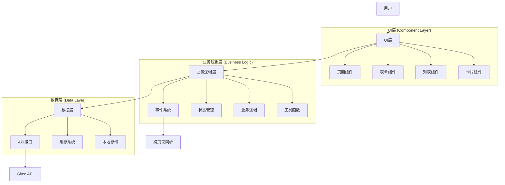
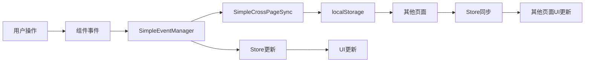
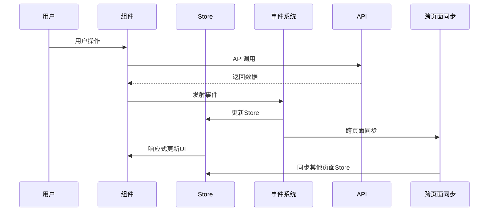
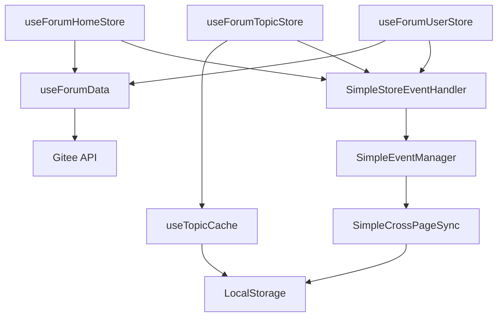
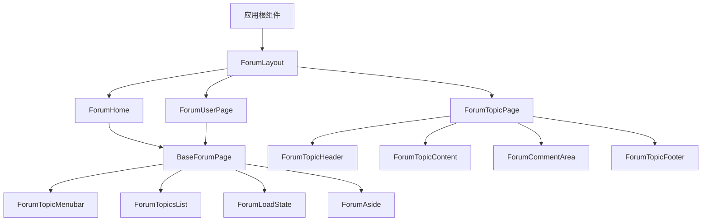
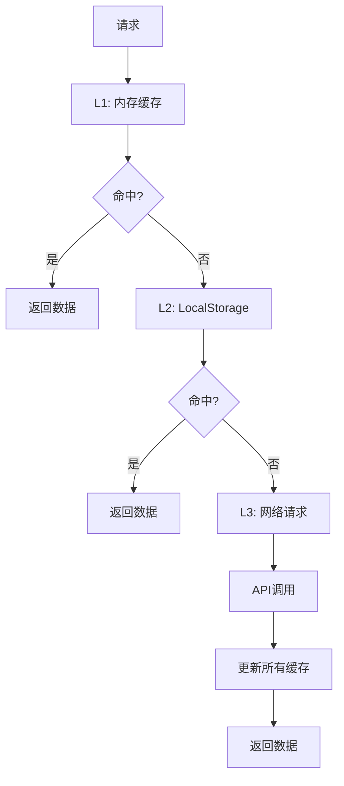

# Forum 架构图

## 🏗️ 系统架构概览

```mermaid
graph TB
    User[用户] --> UI[UI层]
    UI --> BL[业务逻辑层]
    BL --> DL[数据层]

    subgraph "UI层 (Component Layer)"
        UI --> Pages[页面组件]
        UI --> Forms[表单组件]
        UI --> Lists[列表组件]
        UI --> Cards[卡片组件]
    end

    subgraph "业务逻辑层 (Business Logic)"
        BL --> Events[事件系统]
        BL --> Stores[状态管理]
        BL --> Composables[业务逻辑]
        BL --> Utils[工具函数]
    end

    subgraph "数据层 (Data Layer)"
        DL --> API[API接口]
        DL --> Cache[缓存系统]
        DL --> Storage[本地存储]
    end

    Events --> CrossPage[跨页面同步]
    API --> Gitee[Gitee API]
```

## 🔄 事件系统架构

```mermaid
graph LR
    A[用户操作] --> B[组件事件]
    B --> C[SimpleEventManager]
    C --> D[Store更新]
    C --> E[SimpleCrossPageSync]
    E --> F[localStorage]
    F --> G[其他页面]
    G --> H[Store同步]
    D --> I[UI更新]
    H --> J[其他页面UI更新]
```

## 📊 数据流向

```mermaid
sequenceDiagram
    participant U as 用户
    participant C as 组件
    participant S as Store
    participant E as 事件系统
    participant A as API
    participant CS as 跨页面同步

    U->>C: 用户操作
    C->>A: API调用
    A-->>C: 返回数据
    C->>E: 发射事件
    E->>S: 更新Store
    E->>CS: 跨页面同步
    S->>C: 响应式更新UI
    CS->>S: 同步其他页面Store
```

## 🏪 Store关系图

```mermaid
graph TB
    HST[useForumHomeStore] --> FD[useForumData]
    UST[useForumUserStore] --> FD
    TST[useForumTopicStore] --> TC[useTopicCache]

    HST --> SEH[SimpleStoreEventHandler]
    UST --> SEH
    TST --> SEH

    SEH --> SEM[SimpleEventManager]
    SEM --> SCP[SimpleCrossPageSync]

    FD --> API[Gitee API]
    TC --> LS[LocalStorage]
    SCP --> LS
```

## 📱 组件层次结构

```mermaid
graph TB
    App[应用根组件] --> Forum[ForumLayout]

    Forum --> Home[ForumHome]
    Forum --> User[ForumUserPage]
    Forum --> Topic[ForumTopicPage]

    Home --> Base[BaseForumPage]
    User --> Base

    Base --> MenuBar[ForumTopicMenubar]
    Base --> List[ForumTopicsList]
    Base --> Load[ForumLoadState]
    Base --> Aside[ForumAside]

    Topic --> Header[ForumTopicHeader]
    Topic --> Content[ForumTopicContent]
    Topic --> Comments[ForumCommentArea]
    Topic --> Footer[ForumTopicFooter]
```

## 💾 缓存层次结构

```mermaid
graph TB
    Request[请求] --> L1[L1: 内存缓存]
    L1 --> Hit1{命中?}
    Hit1 -->|是| Return1[返回数据]
    Hit1 -->|否| L2[L2: LocalStorage]

    L2 --> Hit2{命中?}
    Hit2 -->|是| Return2[返回数据]
    Hit2 -->|否| L3[L3: 网络请求]

    L3 --> API[API调用]
    API --> Update[更新所有缓存]
    Update --> Return3[返回数据]
```