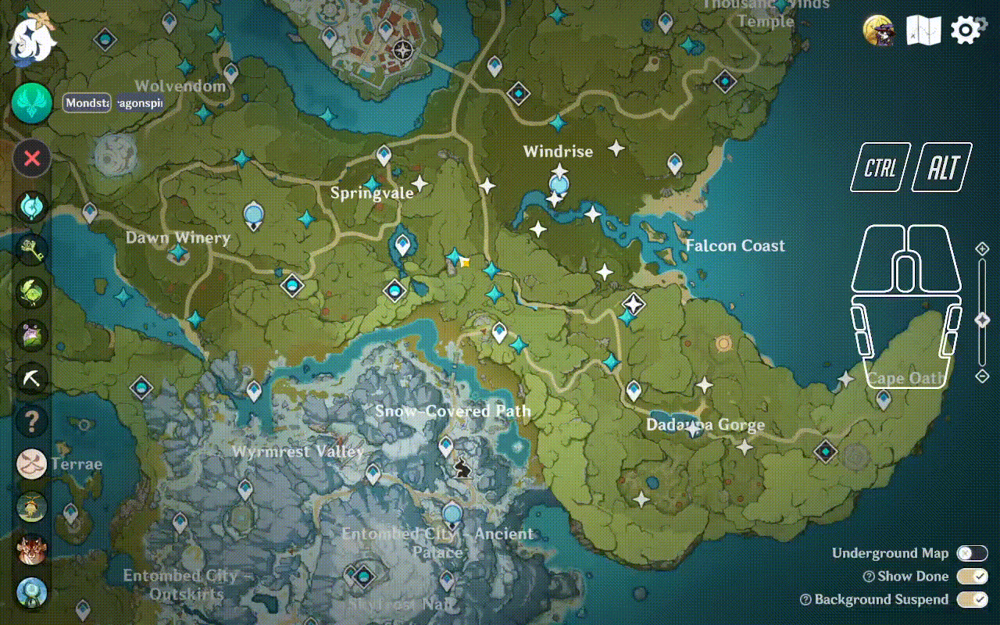

# [Batch Selection] Instructions

Responding to the requests from travellers, batch selection is now available!

- **Secondary click** a marker. The marker will be toggled <b>Done/Undone</b> status.
- Hold **secondary click** and drag over markers. These markers will be changed to <b>Done</b> status.
- Hold **left Alt** and **secondary click**, and drag over markers. These markers will be changed to <b>Undone</b> status.
- Hold **Ctrl** and **secondary click**, and drag a rectangle. Any markers in the rectangle will be changed to <b>Done</b> status.
- Hold **Ctrl**, **left Alt** and **secondary click**, and drag a rectangle. Any markers in the rectangle will be changed to <b>Undone</b> status.

## **Detailed Instructions**

### **Scenario 1: Single Marker Selection**

- **Secondary click** <b>Undone</b> marker will change it to <b>Done</b>.
- **Secondary click** <b>Done</b> marker will change it to <b>Undone</b>.

### **Scenario 2: Swipe Selection**

- Hold **secondary click**, and swipe over markers. <b>Undone</b> markers will be changed to <b>Done</b>, and <b>Done</b> markers will stay unchanged.

- Hold **left Alt** and **secondary click**, and swipe over markers. <b>Done</b> markers will be changed to <b>Undone</b>, and <b>Undone</b> markers will stay unchanged.

### **Scenario 3: Box Selection**

- Hold **Ctrl** and **secondary click**, and drag a rectangular box. Any <b>Undone</b> markers in the box will be changed to <b>Done</b>, and <b>Done</b> markers will stay unchanged.

- Hold **Ctrl**, **left Alt** and **secondary click**, and drag a rectangular box. Any <b>Undone</b> markers in the box will be changed to <b>Done</b>, and <b>Undone</b> markers will stay unchanged.

