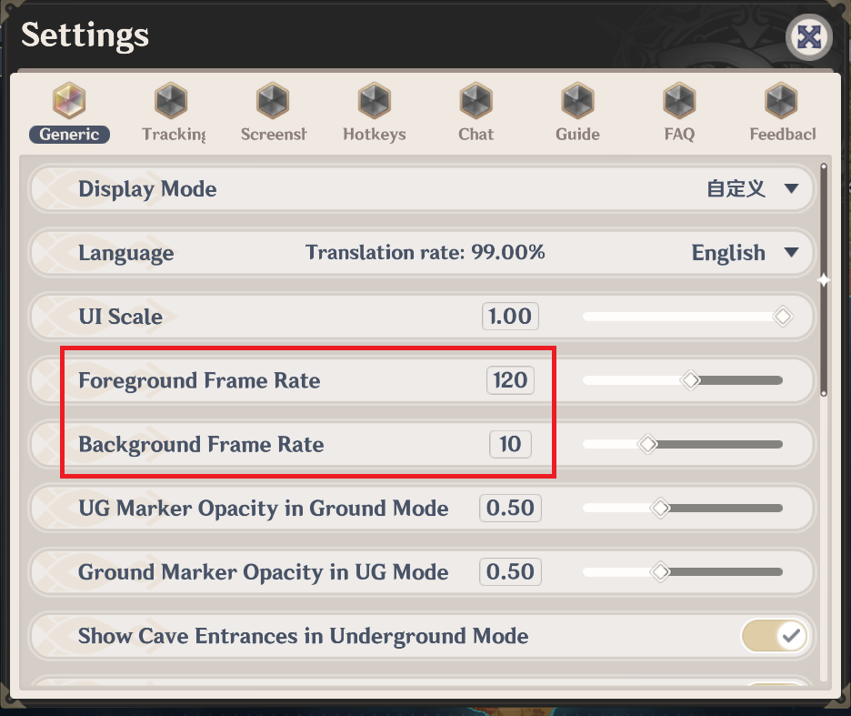
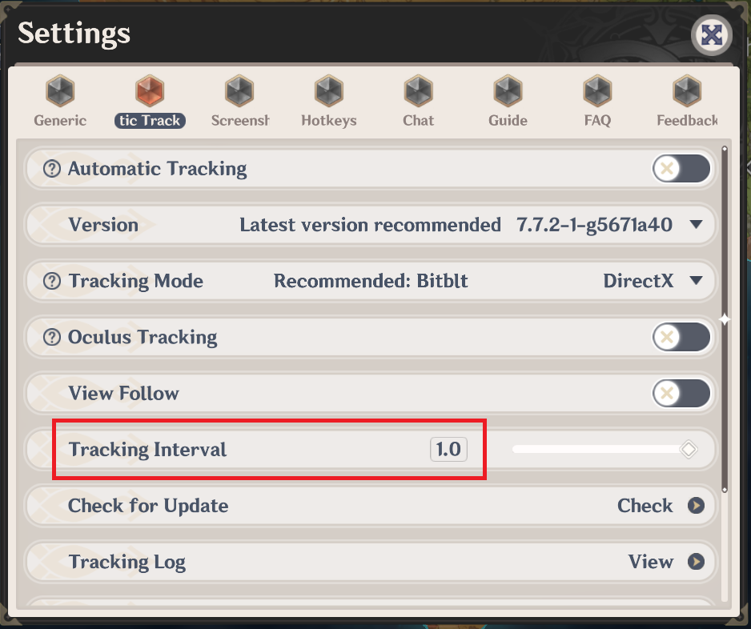

# [Background Usage] Framerate/Tracking Control

## Framerate Control

[Foreground Frame Rate] and [Background Frame Rate] can be configured in the General settings, it is recommended to reduce resource utilization by setting [Foreground Frame Rate] to 30-50 fps and [Background Frame Rate] to 1-10 fps, thus minimizing fps loss in-game.

If you wish to use the [Stay on Top] feature, which pins the map client window on top despite being out of focus, it is recommended to match both frame rate settings' values.

Dragging the frame rate slider to the leftmost position will enable \[V-Sync], which matches the frame rate limit to your monitor's refresh rate.

---

## Tracking Interval

[Tracking Interval] can be found under [Automatic Tracking] settings, the unit of its value is **second**.

Reducing [Tracking Interval] will increase CPU usage (minimum 0.1 sec);

Increasing [Tracking Interval] will reduce CPU usage (maximum 1.0 sec), while also reducing player indicator responsiveness.

