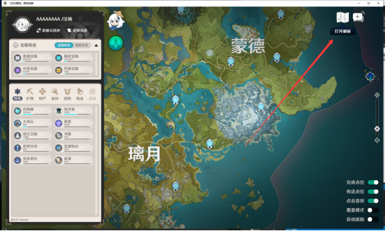
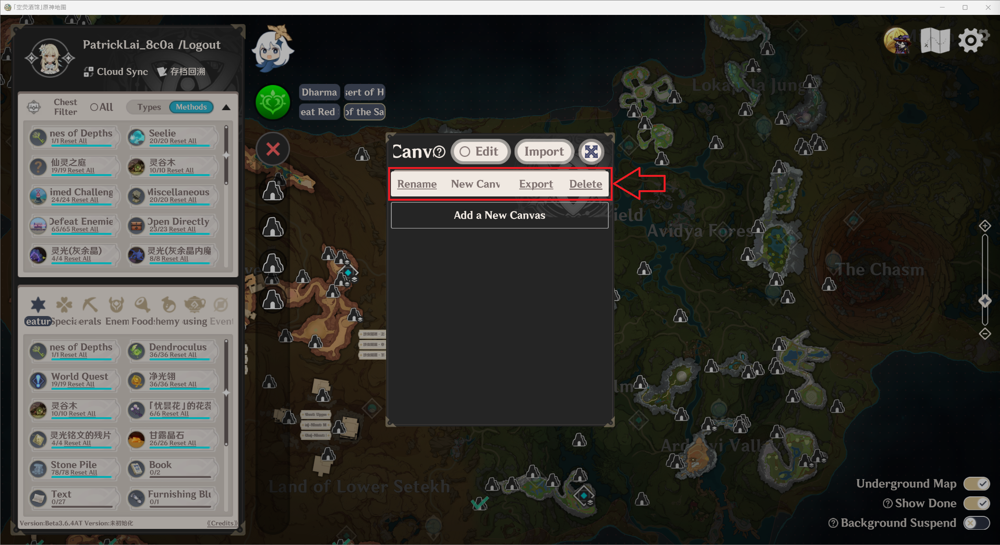
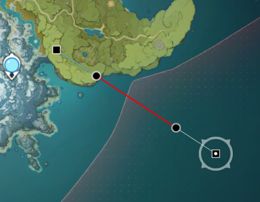
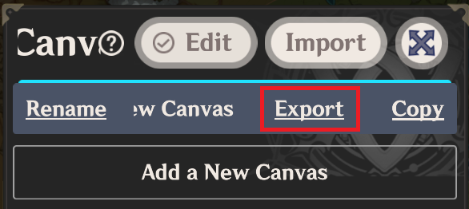
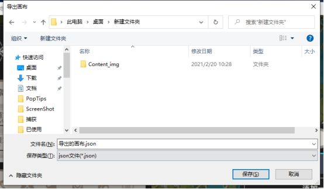

# [Custom Path Planner (Canvas)] Guide

Hotkey summary:

1. Left Alt + primary click: Create/add a path
2. Left Ctrl: Hold to show path anchors
3. Double primary click: Place an anchor on a path
4. Secondary click on **round anchors**: reset the path curvature at this anchor
5. Secondary click on **square anchors**: delete anchors
6. Enter: Conclude editing on the current path

---

## Basic Functionality Guide

**step** 1. Click on the map icon located in the upper right

**step** 2. Select "Add a New Canvas"

**step** 3. Select the newly created canvas (indicated by darkened background)

(Canvas under selection, click on it again to deselect)

**step** 4. Toggle editing

(Picture shows editing toggled ON, click on it again to toggle OFF)

**step** 5. **Hold Alt and primary click** on any location to create a path

**step** 6. Holding control allows control over anchors on the path

At this stage, use **primary click** to control the anchors,  
use **secondary click** on round anchors to reset path curvature,  
use **secondary click** on square anchors to delete it,  
**double click** on the path to place an anchor.

**step** 7. Hit **Enter** to conclude editing this path

**step** 8. Repeat **step** 1 thourgh 7 (note: upon exiting editing via Enter, click on a path to begin editing it)

## Export Guide

Open the Canvas list, select "Export" and save to a desirable location

## Import Guide

Open the Canvas list, select "Import" and open the desirable save

