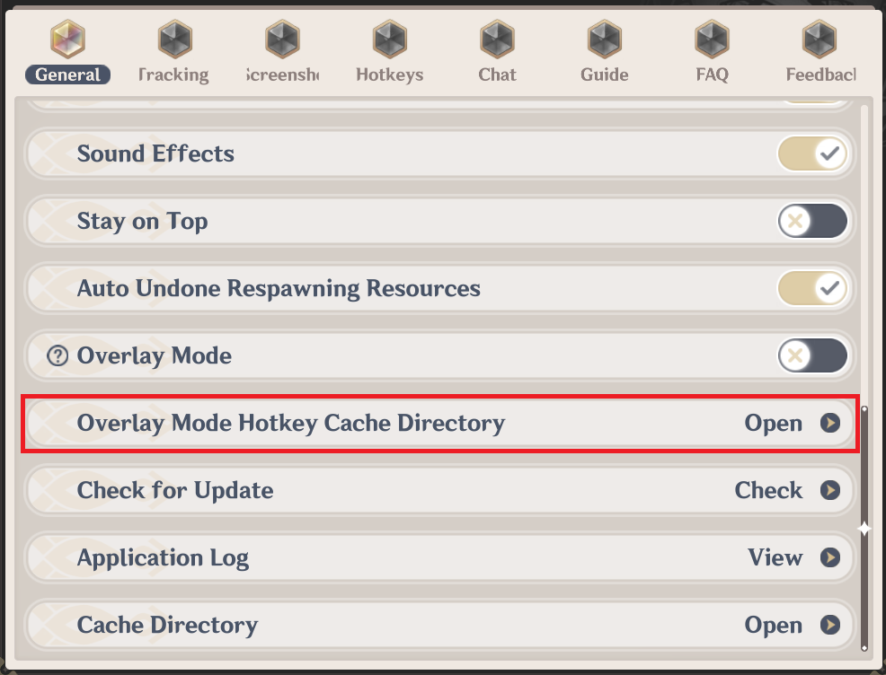

# [Overlay Mode] Instructions

## Introduction

Overlay Mode <b>displays the map client </b>over the <b>Genshin game window</b>. The mode benefits players who only have one monitor, allowing a quicker switch between the game and the map client.

Map client displaying on game Window

## Instructions

- Overlay Mode only functions properly when the Genshin is running under a non-fullscreen mode
- For users who prefer a fullscreen experience, please follow the instructions in: [Launching The Game in Windowed Fullscreen](./Fullscreen-Windowed/Launching.md)
- The map cannot be summoned to the top when Genshin is in exclusive fullscreen. Try setting Genshin to windowed, quitting, or using the **Alt+Enter** shortcut to switch it to windowed without changing the game resolution
- When Overlay Mode is enabled, a tip is displayed.

Overlay Mode enabled Tip

- Pressing **Alt+M**, **M**, **Esc**, or clicking on the close button at the top right corner will hide the map client and return you to the game

Close Button - Go Back to Game

- Once Overlay Mode is enabled successfully, a **Paimon Icon** displays on the left of the minimap in-game
- If the Paimon Icon does not appear, the **PopTips** likely loaded unsuccessfully. This may be caused by system permission denial, you can launch PopTips plugin manually by executing **_map folder location_\Map_Data\Plugins\x86_64\tips.exe**

Paimon Icon

- You can drag the Paimon Icon to change its position
  Either double-clicking on Paimon Icon or pressing Alt+M can summon the map
  Right-clicking on Paimon Icon in the system tray allow customization of shortcut keybinds. (Sorry for the lack of translation for this part)

Modify Switching Shortcut

- Firewalls may cause failure in launching Overlay Mode. We hope we can solve this problem in the coming future.

## FAQs

- If the shortcut conflicts with another shortcut, you can delete all files in hotkey cache directory. After the deletion, the shortcut will be reset to its default: **Alt+M**.

