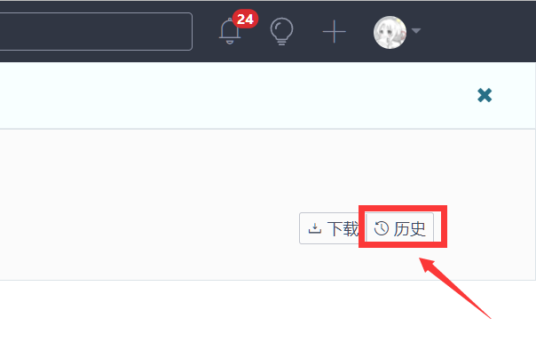
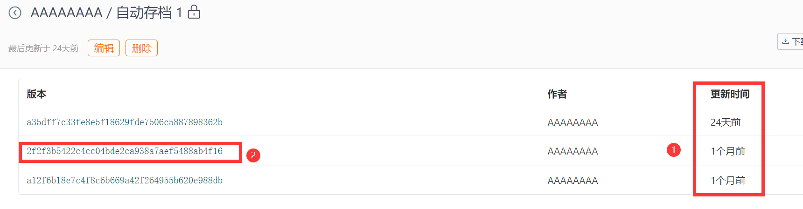
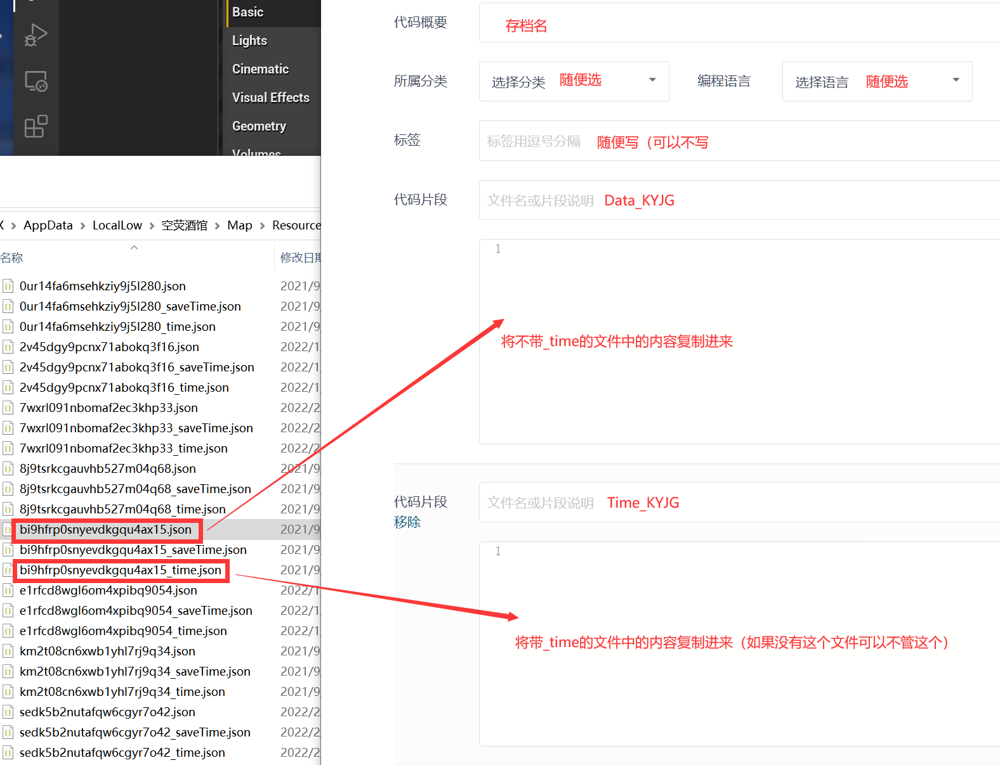

# [Restore/Recover] Progress Recovery From Stored Data

## 1. Return save to an archived timestamp

Log into [Gitee](https://gitee.com/) and select "Create Code"

Then click "Back"

Select the save slot that is to be recovered

Click on "History"

Use the "Update time" to determine the desirable version of save and select it

Copy all the content to a clipboard

and select "Edit"

Overwrite the information indicated in the picture below with the content copied previously. Save to finish the recovery process.

Note: At the first launch of the map client after a recovery, a prompt will pop-up to request syncing to the cloud, follow the instruction to use the cloud save instead
(please double check the "update time" if the prompt does not show up)

## 2. Accidental Save Deletion Recovery

Log into [Gitee](https://gitee.com/) and select "Create Code"

Locate the map client's cache folder, and select the desired save using "Date Modified"

Enter the file contents respectively into the section indicated in the picture below and submit, a save will appear in the list of saves on your map client.

